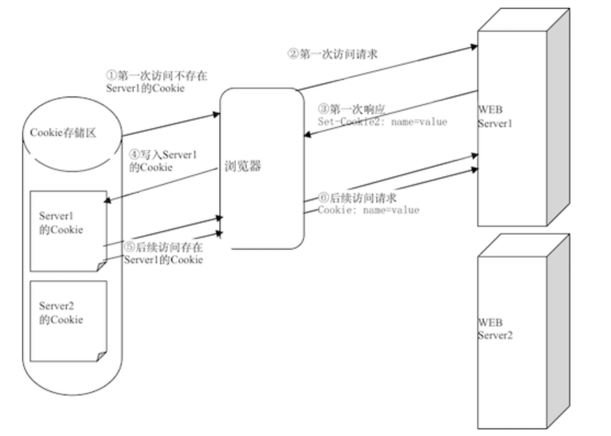

### Cookie

- 完成会话跟踪的一种机制: 采用的是在客户端保持 HTTP 状态信息的方案
- `Cookie`是在浏览器访问 WEB 服务器的某个资源时，由 WEB 服务器在 HTTP 响应消息头中附带传送给浏览器的一个小文本文件
- 一旦 WEB 浏览器保存了某个`Cookie`，那么它在以后每次访问该 WEB 服务器时，都会在 HTTP 请求头中将这个 Cookie 回传给 WEB 服务器



### Cookie 相关 API

#### 写入 Cookie

```java
//1. 创建一个Cookie对象
Cookie cookie = new Cookie("name", "ang");
//2. setMaxAge: 设置Cookie 的最大时效,以秒为单位，若为0，表示立即删除该Cookie
// 若为负数，表示不存储改Cookie
cookie.setMaxAge(30);
//3. 设置Cookie的作用范围
cookie.setPath(request.getContextPath())
//4. 调用response 的一个方法把Cookie传给客户端
response.addCookie(cookie);
```

#### 获取 Cookie

```java
Cookie[] cookies = request.getCookies();
if(cookies != null && cookies.length > 0) {
    for (Cookie cookie: cookies)
        out.print(cookie.getName() + ": " + cookie.getValue());
}
```

### 会话 cookie 和持久 cookie

- 如果不设置过期时间，则表示这个 cookie 生命周期为浏览器会话期间，只要关闭浏览器窗口，cookie 就消失了。这种生命期为浏览器会话期的 cookie 被称为会话 cookie。会话 cookie 一般不保存在硬盘上而是保存在内存里.
- 如果设置了过期时间，浏览器就会把 cookie 保存到硬盘上，关闭后再次打开浏览器，这些 cookie 依然有效直到超过设定的过期时间

### HttpSession

- 在服务器端保持 HTTP 状态信息的方案
- **_产生`Session`对象的过程_**: 当程序需要为某个客户端的请求创建一个 session 时，服务器首先检查这个客户端的请求里是否包含了一个 session 标识(即 sessionId),如果已经包含一个 sessionId 则说明以前已经为此客户创建过 session，服务器就按照 session id 把这个 session 检索出来使用(如果检索不到，可能会新建一个，这种情况可能出现在服务端已经删除了该用户对应的 session 对象，但用户人为地在请求的 URL 后面附加上一个 JSESSION 的参数)。如果客户请求不包含 sessionId，则为此客户创建一个 session 并且生成一个与此 session 相关联的 sessionId，这个 session id 将在本次响应中返回给客户端保存。
- **_使用`Cookie`来跟踪 Session_**: session 通过 SessionID 来区分不同的客户, session 是以 cookie 或 URL 重写为基础的，默认使用 cookie 来实现，系统会创造一个名为 JSESSIONID 的输出 cookie，这称之为 session cookie,以区别 persistent cookies(也就是我们通常所说的 cookie),session cookie 是存储于浏览器内存中的，并不是写到硬盘上的，通常看不到 JSESSIONID，但是当把浏览器的 cookie 禁止后，web 服务器会采用 URL 重写的方式传递

### HttpSession 的生命周期

- **_创建一个 HttpSession 对象_** 一个常见的错误是以为 session 在有客户端访问时就被创建，然而事实是直到某 server 端程序(如 Servlet)调用 HttpServletRequest.getSession(true) 或者 HttpServletRequest.getSession()这样的语句时才会被创建
- **_销毁 HttpSession 对象_**
  1. 程序调用 HttpSession.invalidate()
  2. 距离上一次收到客户端发送的 session id 时间间隔超过了 session 的最大有效时间
  3. 服务器进程被停止(或当前 Web 应用被卸载) 注意：关闭浏览器只会使存储在客户端浏览器内存中的 session cookie 失效，不会使服务器端的 session 对象失效。

### HttpSession 相关的 API

- 获取`Session`对象 `request.getSession(), request.getSession(boolean create)`
- 属性相关的: `setAttribute, getAttribute, removeAttribute`
- 使 Session 失效：`invalidate()`
- 设置其最大失效时间: `setMaxInactiveInterval`

### URL 重写

Servlet 规范中引入了一种补充的会话管理机制，它允许不支持 Cookie 的浏览器也可以与 WEB 服务器保持连续的会话。
将会话标识号以参数形式附加在超链接的 URL 地址后面的技术称为 URL 重写。
代码:

```html
<a href="<%= response.encodeURL("login.jsp") %>"login</a>
```
