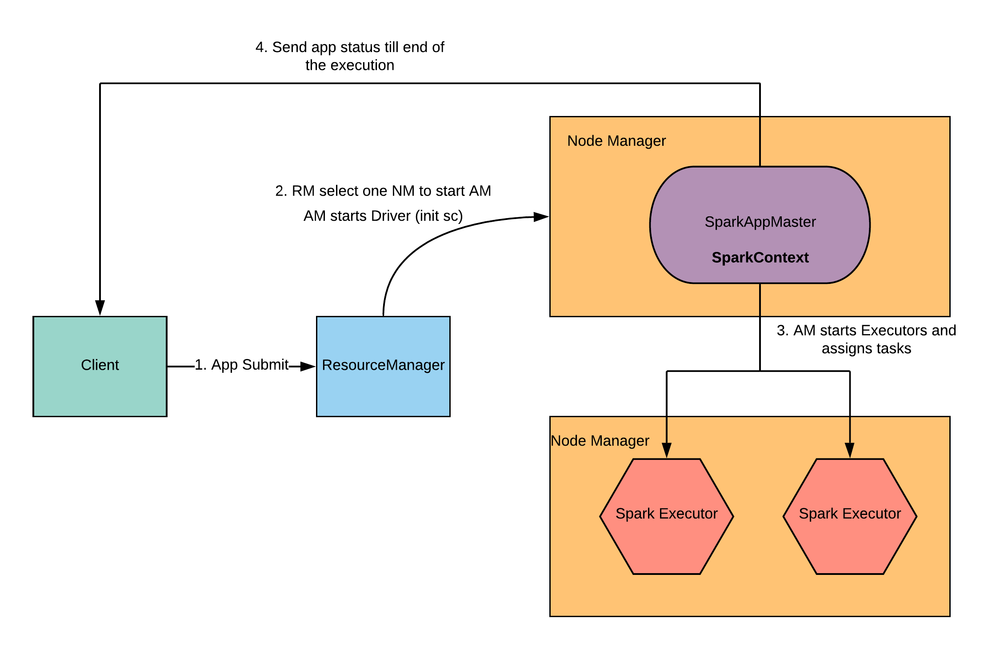

### Driver

- A Spark driver (aka an application’s driver process) is a JVM process that hosts SparkContext for a Spark application. It is the master node in a Spark application.
- It splits a Spark application into tasks and schedules them to run on executors.
- A driver is where the task scheduler lives and spawns tasks across workers.
- A driver coordinates workers and overall execution of tasks.
- It hosts Web UI for the environment.

### Executor

- Executor is a distributed agent that is responsible for executing tasks.
- Executors send metrics (and heartbeats) to the driver.
- Executors provide in-memory storage for RDDs that are cached in Spark applications (via Block Manager).

### Spark on Yarn

